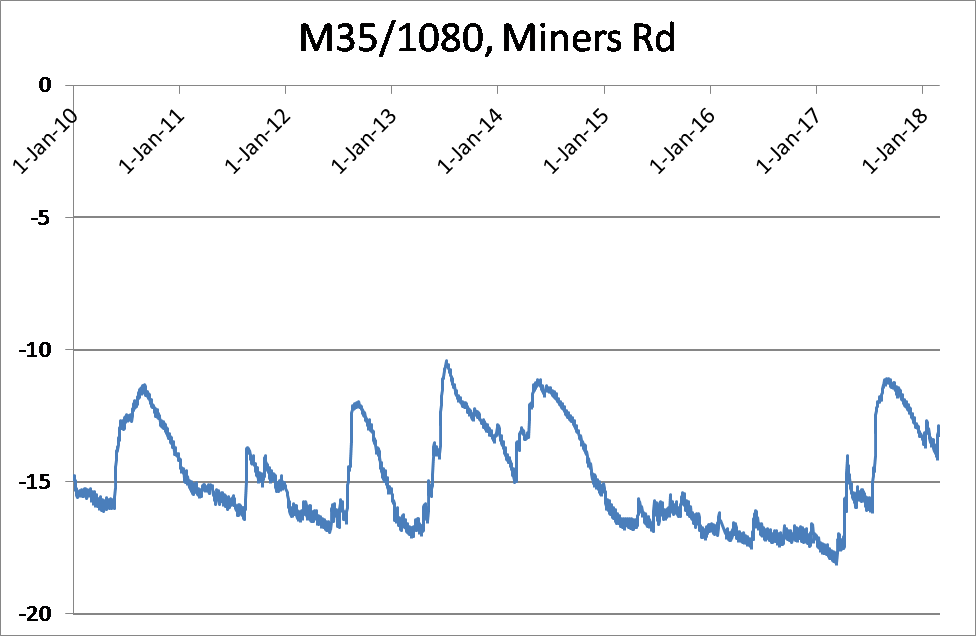

Groundwater
================================

.. raw:: html
   :file: bokeh_html/fresh_gw_map_2018-03-02.html

Groundwater levels and forecast
--------------------------------
Groundwater levels are healthy because of last year’s wet winter. Additional rain in spring/summer also helped by reducing irrigation demand. Levels have dropped, as per normal, over the spring and summer, when growing plants and evaporation prevent most rain water from reaching groundwater. Even so, there were moderate increases in groundwater levels after heavy rain events in January and February.

Groundwater levels in February 2018 were generally average to above average across the region. This is much better than this time last year, when 64% of our monitoring wells had low or very low water levels. The monitoring well (shown below) is provided as an example of seasonal groundwater levels since 2011.

	 Groundwater depth below surface in a West Melton monitoring well.
