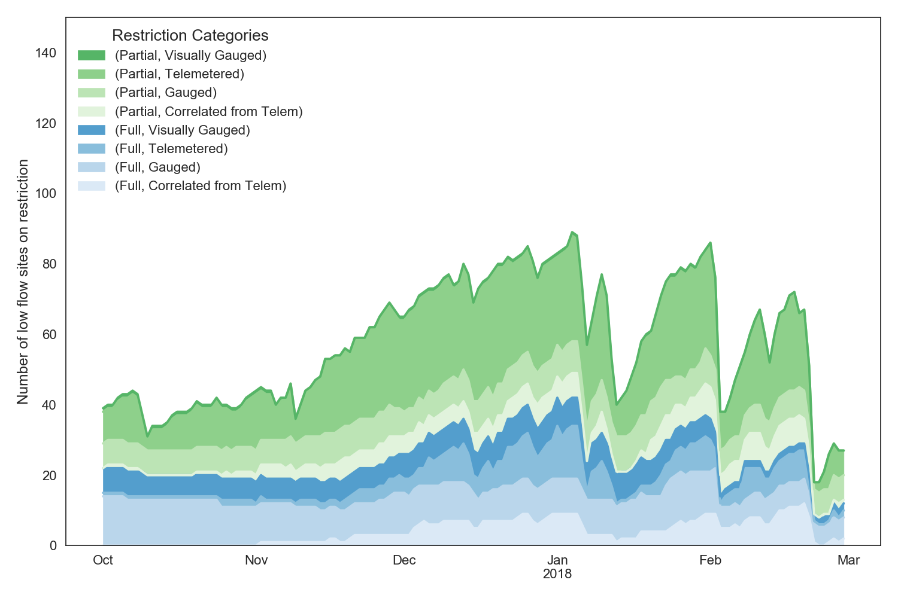
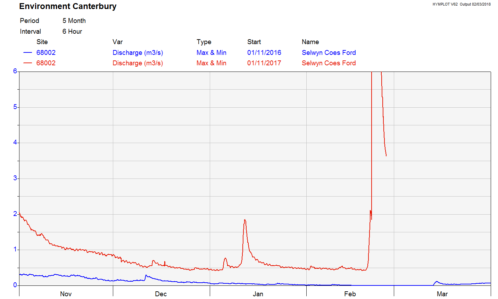
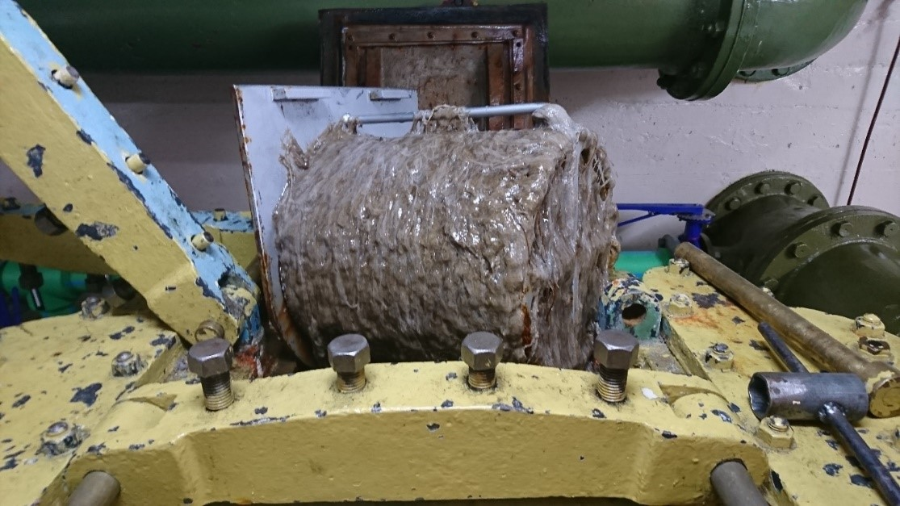

Precipitation and Surface Water
=====================================================

.. raw:: html
   :file: bokeh_html/precip_sw_2018-03-02.html

Surface take restrictions for irrigation
----------------------------------------------
Irrigation restrictions varied over summer months in response to weather patterns.  In comparison with last year, there were fewer restrictions on water takes, particularly at the beginning of the irrigation season (based on telemetered and gauged data).

	 Low flow site restrictions during the 2017-2018 irrigation season.

Selwyn River/Waikirikiri flows
----------------------------------
The Selwyn River has held up well this summer with sustained flows (see graph below, 2016-17 summer in blue and this summer in red).

This confirms the Environment Canterbury advice that a winter of high rainfall would recharge groundwater and maintain flows in the following summer.

Also of note is that the river reconnected across the plains after the rainfall from Cyclone Gita giving a rapid rise from around 0.5 to 90 cumecs that caught out a camper van parked at Coes Ford (against advice).

	 Flow in the Selwyn River compared year on year from November until the end of February.

Waimakariri high country lakes fish rash
-----------------------------------------
In November 2017 Fish & Game closed six high country lakes in the Craigieburn-Cass area for fishing because of a red rash on fish.  The concern was over a red rash being found on fish taken from the lakes and that it could be a new virus or caused by an invasive species.  Testing of the fish by MPI found nothing, despite concerns it could be a new virus or invasive species.

In December Environment Canterbury staff (particularly Dr Adrian Meredith) worked with F&G to catch fish and measure environmental variables in the lakes.  The results are inconclusive but the most likely stress was from high water temperatures.

The long period of hot and still weather from November to January raised lake temperatures to above 20ºC which is known to cause stress in trout.  January measurements of lake temperatures showed temperatures as high as 24ºC.

The latest round of monitoring (23 February) shows temperatures are significantly lower, averaging around 15ºC, because of rainfall and stormy weather.

Lindavia in Canterbury lakes
--------------------------------
Lindavia (commonly referred to as “lake snow”) has recently been found in Lake Lyndon.  It has now been established in Lakes: Aviemore, Benmore, Ohau, Tekapo, Coleridge, Lyndon, and Sumner and is likely to be in more lakes.

The discoveries of Lindavia in most of our big lakes suggest that it has become entrenched in Canterbury.  Current research is focused on whether this means a significant shift in lake ecosystems.

Lindavia (an invasive species of diatom) has caused concern for water supply and hydroelectricity generation in Otago and Canterbury lakes.  Lindavia produces a mucus that can clog up filters in water intakes and fouls fishing lines.  It is this mucus that is referred to as “lake snow”.  In Lake Wanaka it has been observed to produce rafts of floating lake snow.

Manaaki Whenua-Landcare Research is running an MBIE “Smart Ideas” research programme looking at detection tools and finding other information on Lindavia.  Environment Canterbury is well linked into this research programme and is also funding work (jointly with Otago and Southland regional councils) by the University of Otago on coring southern lakes sediment to find when Lindavia reached the lakes.

	 Lindavia mucus at Lake Tekapo power station.
